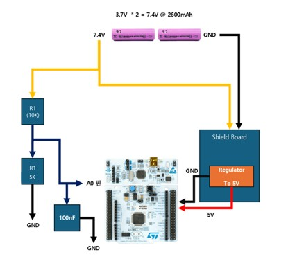

# STM32 3.3V ADC 인터페이스 규격에 맞춘 전압 분배 및 측정 회로 만들기




### 1. ADC 입력 전압 범위

| 배터리 상태 | VBAT | Vadc (분배 후) |
| :--- | :--- | :--- |
| 완충 | 8.4V (4.2V/셀) | 2.837V |
| 공칭 전압 | 7.4V (3.7V/셀) | 2.499V |
| **충전 권장 시점** | **6.6V (3.3V/셀)** | **2.229V** |
| 방전 하한(위험) | 6.0V (3.0V/셀) | 2.027V |

### 2. ADC Raw 값 (12비트, Vref=3.3V 기준)

| 상태 | Vadc | ADC Raw (12bit) |
| :--- | :--- | :--- |
| 완충 (8.4V) | 2.837V | 약 3519 |
| 공칭 (7.4V) | 2.499V | 약 3100 |
| **충전 권장 (6.6V)** | **2.229V** | **약 2765** |
| 방전 하한 (6.0V) | 2.027V | 약 2515 |

*공칭 : 배터리의 표준/평균 동작 전압*

### 3. 충전 필요 판단 기준 

리튬이온 셀 특성상 3.0V 이하는 급격히 손상 위험이 커지므로,
**여유를 두고 3.3V/셀에서 부저**을 울리는 것으로 결정

| 판단 | 셀당 전압 | 총 VBAT | 동작 |
| :--- | :--- | :--- | :--- |
| 정상 | > 3.4V | > 6.8V | 알람 OFF |
| **충전 알람 ON** | **≤ 3.3V** | **≤ 6.6V** | **알람 시작** |

---

### 3.회로도 


**배터리 제원:**
* 3.7V * 2 = 7.4V @ 2600mAh

**분배 회로 구성 요소:**
* R1  (10K)
* R2  (가변저항 10K)--> 뉴클레오 103RB 회로보호용 부착
* R3  (5.1K)---> 10K로 2개로 제작
* C1  100nF
* A0 핀--->PC3 연결
* 부저 --->PB7 연결
---
### 4.실측
* 가변저항 10K --> A0 : 2.79V
* 가변저항 0K  --> A0 : 1.68V


### 5. ADC 샘플링 함수
```c
// ADC 노이즈 제거를 위한 N회 평균 측정 함수
uint32_t Read_ADC_Average(uint8_t count)
{
    uint32_t sum = 0;
    for (uint8_t i = 0; i < count; i++)
    {
        HAL_ADC_Start(&hadc1);
        if (HAL_ADC_PollForConversion(&hadc1, 10) == HAL_OK)
        {
            sum += HAL_ADC_GetValue(&hadc1);
        }
        HAL_ADC_Stop(&hadc1);
    }
    return (count > 0) ? (sum / count) : 0;
}
/* USER CODE END 0 */
```

### 6. 메인 루프 모니터링 
```c
/* USER CODE BEGIN WHILE */
// 1초에 한 번 배터리 전압 체크 및 방전 시 PB7 부저 울림 (Non-blocking)
if (now - last_battery_tick >= 1000) {
    adc_raw = Read_ADC_Average(10);
    v_adc = ((float)adc_raw / 4095.0f) * VREF;
    v_input = v_adc * ((R1_OHM + R2_OHM) / R2_OHM);

    if (v_input <= 6.4f) { // 2S 배터리 6.4V 이하 방전 감지
        printf("⚠️ [경고] 2S 배터리 방전! (전압: %.2fV)\r\n", v_input);
        // PB7 부저 0.15초 켜졌다가 끔
        HAL_GPIO_WritePin(GPIOB, GPIO_PIN_7, GPIO_PIN_SET);
        HAL_Delay(150);
        HAL_GPIO_WritePin(GPIOB, GPIO_PIN_7, GPIO_PIN_RESET);
    } else {
        HAL_GPIO_WritePin(GPIOB, GPIO_PIN_7, GPIO_PIN_RESET);
    }
    last_battery_tick = now;
}
/* USER CODE END WHILE */
```

---


